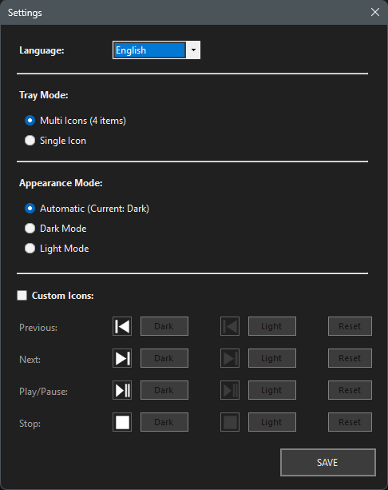
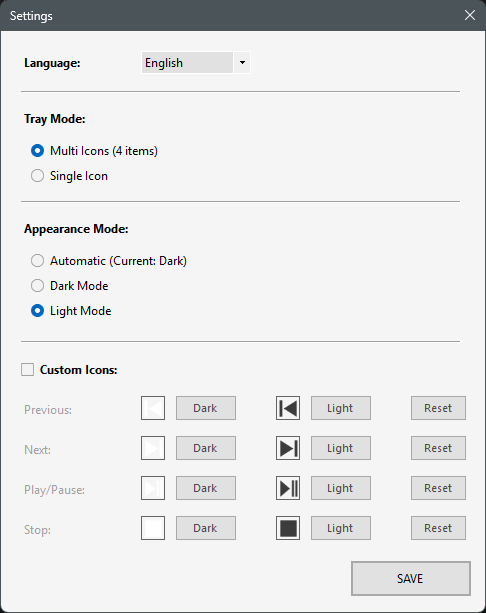
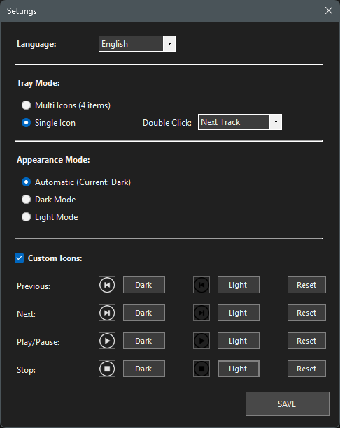



  

  # Media Tray Master
  ### Professional Play Controlling Tool

  
  
  
  

  [English](#-english) | [Türkçe](#-türkçe)

---

## 🇺🇸 English

**Media Tray Master** is a lightweight, portable, and dependency-free Windows utility designed to control your media playback directly from the system tray without interrupting your workflow. It supports all major media players (Spotify, YouTube, VLC, etc.) that respect Windows Media Keys.

### ✨ Key Features

* **🚀 Zero Dependencies:** Single `.exe` file. No installation required. Just download and run.
* **🎨 Smart Theming:** Automatically detects Windows Dark/Light mode and adapts instantly.
* **🎛️ Hybrid Control:** Choose between **Multi-Icon** mode (classic) or **Single-Icon** (compact) mode with customizable double-click actions.
* **🖌️ Custom Icons:** Don't like the default look? Upload your own icons, and the engine will re-color them for dark/light themes automatically.
* **🔒 Single Instance:** Prevents accidental multiple launches using Mutex.
* **🌍 Multi-Language:** Native support for English and Turkish (Auto-detects system language).

### 📸 Screenshots

#### Theme & Appearance
| Dark Mode | Light Mode |
|:---:|:---:|
|  |  |

#### Tray Modes
| Dark Tray | Light Tray | Custom Icons |
|:---:|:---:|:---:|
|  |  |  |

#### Advanced Settings
| Compact Mode | Customization |
|:---:|:---:|
| **Single Icon Mode:** Save space on your taskbar.  | **Icon Engine:** Import your own style.  |

### 📥 Installation

1.  Go to the **[Releases](../../releases)** page.
2.  Download the latest `MediaTrayMaster.exe`.
3.  Run it! (Optionally, add a shortcut to `shell:startup` to run on boot).

---

## 🇹🇷 Türkçe

**Media Tray Master**, Windows iş akışınızı bölmeden, doğrudan sistem tepsisinden (system tray) medya oynatıcılarınızı kontrol etmenizi sağlayan hafif, kurulumsuz ve profesyonel bir araçtır. Windows Medya Tuşlarını destekleyen tüm uygulamalarla (Spotify, YouTube, VLC vb.) uyumludur.

### ✨ Öne Çıkan Özellikler

* **🚀 Bağımlılık Yok:** Tek bir `.exe` dosyasıdır. Kurulum gerektirmez, indir ve çalıştır.
* **🎨 Akıllı Tema:** Windows'un Koyu/Açık modunu otomatik algılar ve anında uyum sağlar.
* **🎛️ Hibrit Kontrol:** İster **Çoklu Simge** (klasik 4 buton), ister **Tek Simge** (kompakt) modunu kullanın. Tek simge modunda çift tıklama işlevini (Sonraki, Durdur vb.) özelleştirebilirsiniz.
* **🖌️ Özel Simgeler:** Varsayılan simgeleri beğenmediniz mi? Kendi PNG dosyalarınızı yükleyin, motorumuz onları temaya uygun şekilde otomatik boyasın.
* **🔒 Tekil Çalışma:** Mutex koruması sayesinde uygulamanın ikinci kez açılmasını engeller.
* **🌍 Çoklu Dil:** Türkçe ve İngilizce desteği (Sistem diline göre otomatik başlar).

### 📸 Ekran Görüntüleri

#### Tema ve Görünüm
| Koyu Mod | Açık Mod |
|:---:|:---:|
|  |  |

#### Tepsi (Tray) Görünümleri
| Koyu Tepsi | Açık Tepsi | Özel Simgeler |
|:---:|:---:|:---:|
|  |  |  |

#### Gelişmiş Ayarlar
| Kompakt Mod | Özelleştirme |
|:---:|:---:|
| **Tek Simge Modu:** Görev çubuğunda yer açın.  | **İkon Motoru:** Kendi tarzınızı yansıtın.  |

### 📥 Kurulum

1.  **[Releases](../../releases)** sayfasına gidin.
2.  En son sürüm `MediaTrayMaster.exe` dosyasını indirin.
3.  Çalıştırın! (İsterseniz başlangıçta çalışması için `shell:startup` klasörüne kısayol atabilirsiniz).

---

### 🛠️ Development / Geliştirme

* **Language:** C#
* **Framework:** .NET 7.0 / 8.0+ (Compatible with Windows 10/11)
* **IDE:** Visual Studio 2026
* **Graphics:** System.Drawing.Common (GDI+)

### ⚖️ License

Distributed under the MIT License. See `LICENSE` for more information.

### 🦅 Contact

**Developer:** Eagle

**Email:** trup40@protonmail.com

---

  © 2025 Media Tray Master. All Rights Reserved.

